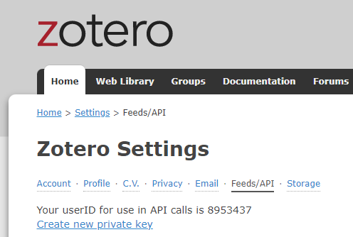
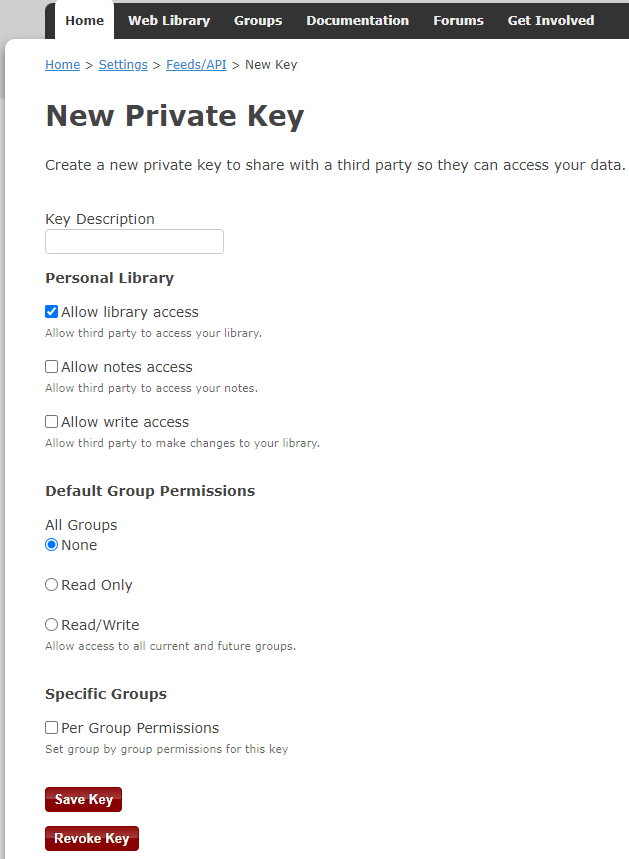

# ep\_zotero: Insert Zotero citations into your pad and create references

## Features

* API connection to Zotero, a free tool to support research, citation and more
* Insertion of citations and references into Etherpad documents using different citation styles

## Installation

Prerequisite: at least Etherpad version 1.8.14

### Using Git

Clone the plugin in the plugins directory (node_modules) of your Etherpad server.
```
git clone https://github.com/ukkkr/ep_zotero.git /etherpad/directory.../node_modules/ep_zotero
```
Make sure to name the plugin directory `ep_zotero`!
Restart your Etherpad service.

### Manually

Copy the plugin folder `ep_zotero` into the `node_modules` folder of your Etherpad server.
Restart your Etherpad service.

## Configuration

Access to a Zotero account is prerequisite for the use of this plugin.

1. Register at https://www.zotero.org/user/login for a (free) account and login there.

2. After login go to https://www.zotero.org/settings/keys and save your **userID** for API calls

<a></a>

3. On https://www.zotero.org/settings/keys/new create a new private key.

<a></a>

Provide a **Key Description** and check at least **Allow library access**. 
After pressing **Save Key** the key is shown `only once`. Save your new UserKey immediately.

4. Create a new file named `zotero_api.json` and put the following code into it replacing the shown values for UserId and UserKey by your previously saved values.
```
{
    "UserId" : "8953437",
    "UserKey" : "5khMACbv48chsjzkmFe3nA3h"
}
```
5. Save `zotero_api.json` and put it into your base folder `etherpad-lite`. This is the parent folder of the `node_modules` folder containing the `ep_zotero` plugin.

## Usage

The GUI language is all in German currently.

On the right editbar Menu you see two new buttons with these icons:

<h3>
    <link rel="stylesheet" href="https://use.fontawesome.com/releases/v5.12.1/css/all.css"          crossorigin="anonymous"><span class="fas fa-quote-right"></span> -> Insert citation source from Zotero:
    </link>
</h3>

* Opens a popup menu showing the accessible libraries and collections of your Zotero account. 
* Browsing through these collections leads you to screen with **Insert** buttons. 
* Immediately paste the selected citation source in a your preferred citation style on the selected cursor position. 
* A valid citation source is identified by a tooltip and a slightly blured text. Valid citation sources will be referred to in the literature references. 
* The popup stays open for further insertions until you close it by dialog. Or press the same editbar button again.
</br>
<h3>
    <link rel="stylesheet" href="https://use.fontawesome.com/releases/v5.12.1/css/all.css" crossorigin="anonymous"> <span class="fas fa-book"></span> -> Insert references:
    </link>
</h3>

* Opens a dialog to select your preferred citation style for the insertion of references that list up all valid citation sources.
* The references are inserted on the last line of the text document (pad).

## Hints

This Etherpad plugin can be found on https://github.com/ukkkr/ep_zotero. It is based on a fork of the https://github.com/IFE-ENSL/ep_zotero repository which seems to be abandoned. Nevertheless thanks to the authors mentioned there.
The original plugin is all written in French language and not compatible with actual versions of Zotero API and jquery. The forked project provides English inline comments and a German GUI. It has been updated to work reliably with the current Zotero Rest API. Beyond it has been enhanced by some new features.

## License
Licensed under the Apache License, Version 2.0 (the "License"); you may not use this file except in compliance with the License. You may obtain a copy of the License at
http://www.apache.org/licenses/LICENSE-2.0
Unless required by applicable law or agreed to in writing, software distributed under the License is distributed on an "AS IS" BASIS, WITHOUT WARRANTIES OR CONDITIONS OF ANY KIND, either express or implied. See the License for the specific language governing permissions and limitations under the License.

## Keywords
etherpad  ep  plugin  zotero  citation  bibliography  references